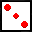

# DANGERdice

> A Python Game Inspired by Tiny Dice Dungeons

<br>

Built on a custom game engine written in Python (3.9). The game engine runs the game as a state machine and 
is able to support a wide variety of GUI components such as typed out dialogue boxes.

This was my first attempt at creating a game engine, so there's plenty of questionable design decisions 
that came about from lack of experience. I am planning to use the things I learned from creating this engine 
to create a new Javascript engine called `BOGGERS.js`. Maybe I will come back and revamp this engine so it
better utilizes the features of `pygame` and `pyglet`. 

# Build Instructions

Read this section if you wish to run this game from the source code itself. 
If you just want to play the game itself, you can download the release.

## Required Dependencies
This game requires only one dependency, and you have the choice of either using `pygame` or `pyglet` (1.5).
This involves a simple installation using your package manager.

```
pip install -r requirements.txt
```

_Note that because `pyglet` was recently adapted to work with the engine, you'll see worse performance 
when running the game with `pyglet`. The temporary workaround was to largely increase the game's clock rate._

If you chose to use `pygame`, go to `core/__init__.py` and find the follow import statement.
```
from .pyglet_lib import loaded_static, loaded_sheets, Image, Label, run, SoundPlayer, Spritesheet
```
Then change it to this import statement.
```
from .pygame_lib import loaded_static, loaded_sheets, Image, Label, run, SoundPlayer, Spritesheet
```

Then you can run `DANGERdice.py` to begin your game!

# Gameplay

## Rules

There's an ingame tutorial on how to battle, but it is also explained here.

1. On a player's turn, the player rolls dice to build up damage. The dice they can roll depends on what dice they have equipped. 
2. Once you roll a die, you cannot roll it again. 
3. If the player rolls _all_ the dice they have equipped, their dice can be rolled _again_. This allows you to keep building up damage (potentially infinitely).
4. They can then end their turn to deal their built-up damage to the enemy.
5. If a player rolls a _one_ during their turn, they automatically forfeit their turn without dealing damage.
5. The goal of each battle is to get your enemy's health to zero or below.

More mechanics become introduced when using different types of dice. Buy them from the shop and equip them in your inventory.

## Available Dice

Dice | Information | Safe?
---- | ----------- | -----
Basic **n**X | Builds up damage (DMG) by the value you roll times **n**. | no
Poison **n**X | Builds up poison damage (PSN) by the value you roll times **n**. | no
Heal **n**X | Builds up healing (HEAL) for yourself by the value you roll times **n**. Healing restores your health and reduces your poison counter. | yes
Divider | Makes your attack a weakening attack. The value you roll determines the factor of weakening. Rolling a divider die multiple times will increase the factor. | yes
Multiplier | Multiplies your current damage (DMG) by the value you roll. | yes

A **safe** die will never forfeit your turn, no matter what value you roll.

Remember that you must deliberately end your turn in order to apply DMG, PSN, HEAL, or weakening.

## On Poison

When you attack with poison damage (PSN), your enemy will be poisoned for that amount of poison damage.
- Players that are poisoned will take damage equal to the poison they have at _the end of their turn_.
- Their poison counter is decreased by 1 every time they take poison damage until it reaches zero.
- If you kill the enemy while you're poisoned, you are guaranteed to not die from poison damage after it's applied.
However, in this case you are left with one health point, so it's probably a lost cause.

## On Divider

When you make a weakening attack, your enemy will be weakened on their turn by the weakening factor. Note that this status only lasts for one turn, even if that turn was ended with a rolled _one_.
- When weakened, the actual DMG a player will deal in their attack will be the current DMG they built up divided by the weakening factor.
- The DMG display will show you the DMG before it becomes divided.
