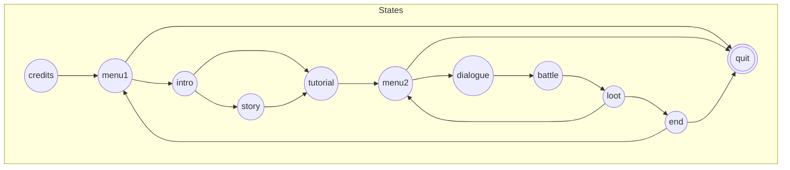
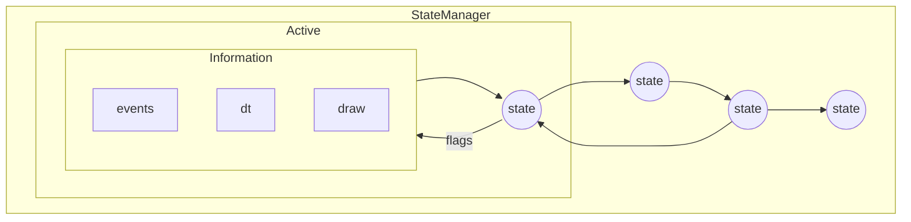

# Core

> [**Go Back**](../../README.md)

<br>

The `core` folder has low-level features that are crucial to running a game. Notable folders include:

- `/control`: Controlling the flow of the entire application.
- `/enums`: Handling user I/O and treating them as events.
- `/components`: Rendering images and text to the screen (with the help of libraries like `pygame`).
- `/path`: Handling pathing and JSON conversions for game data and assets.

The other folders `/pygame_lib` and `/pyglet_lib` are library specific implementations of the core parts.

# `/control`

From a higher level overview, the game is essentially a finite state machine. Each state represents
a "screen" of the game such as a menu screen, saving screen, game over screen, etc. 

In the game DANGERdice, the whole game can be represented as the following state graph.



## `StateManager`

### Background

The `StateManager` is the primary driver behind this finite state machine. 



From this diagram, there are many things to observe about the manager.

- The manager has to keep track of all the states in the FSM.
- The manager can only have one active state at a time.
- The manager has to pass information into that active state.

What type of information does the manager pass into the **active** state?
- `events`: User inputs such as key presses and mouse presses.
- `dt`: Also known as **delta time**. This is passed so the state can execute actions that occur over time 
such as movmenet or timers.
- `draw`: Technically not something that is passed, but is a method the manager calls from the state to 
render graphics.
- Additionally, the manager reads the flags of the states which indicate the manager to transition or quit.

The manager is also responsible for changing the active state when needed. Transitions are a 
two-phase process.

- The manager resets the flag and calls the `cleanup` hook of the active state.
- It changes its active state to the new state and calls the `startup` hook of that new state.

In the end, the `StateManager` runs the whole show. 

### Usage
Using the manager itself is quite easy. There are only two things you need.
- `start`: The name of the starting state. This is the first active state for the manager.
- `states`: A dictionary that maps names to `State` objects. Note that the transitions between states are handled within `State`.

Afterwards, use a `while` loop to repeatedly call `pass_event`, `update`, and `draw` to get the game running.

Example usage of `StateManager`. In this case, the active state is `"start"`.

```python
manager = StateManager("start", {"start": Start(), "end": End()})
while True:
    manager.pass_event(None)
    manager.update(0)
    manager.draw()
```

## `Event`

A user input. Consumed by states to trigger some action such as clicking a button or inputting text.
It only supports key presses and basic mouse clicks.

Under the hood, it is just a bunch of enums. The `enums` folder contains definitions for event types, key presses, and mouse actions.


## `State`

A state which manages a bunch of game objects. It's responsible for passing events, giving information, and drawing objects that it
contains. Usually, a `State` keeps track of data (which are its attributes) that get passed into the objects themselves for display.
Objects can then modify the data.

States also contain two hooks: `startup` and `cleanup`.
- `startup` is called before a state actually runs. This is where you can setup objects and load data.
- `cleanup` is called before a state becomes inactive. This is where you can reset attributes and clean up elements.

Normally you would inherit from this class.

```python
class Test(State):
    def __init__(self):
        super().__init__()
        self.state_info = 1

    def startup(self):
        print(self.state_info)

    def cleanup(self):
        self.state_info = 1

    def handle_event(self, event: Event):
        print(event)

    def update(self, dt: float):
        self.state_info += 1

    def draw(self):
        # Use a label to display text!
        pass
```

# `lib` Folders

These contain the actual implementations of the components and the driver code that starts the whole application.
When creating the game, you only need to import the `__init__.py` file of `/core`. 

Besides the component implementations, there are a few other noteworthy aspects.

# Components

Interfaces for primitive game objects. We use libraries such as `pygame` or `pyglet` to implement them.
All UI and game objects such as player characters are made of these things. For example, a dialogue box
is made of a `AbstractImage` (for the box itself) and `AbstractLabel` (for the text).

**The purpose of this is to keep the game engine library-agnostic.**
**Any library can be used as long as it can implement the following components.**

## `AbstractImage`

An image that is displayed on the game screen. 

It is made up of the image (type depends on library), height, and width. Implementation is straight-forward 
as a library only needs to implement the `blit` and `blit_border` drawing methods.

Here's a `pygame` implementation. Notice how `pygame` uses `Surface` to represent images and we use its
corresponding `blit` method to draw it.

```python
import pygame
from .constants import surface
from ..components import AbstractImage

class Image(AbstractImage):
    def __init__(self, image: pygame.Surface):
        super().__init__(image)
        self.width, self.height = self.image.get_width(), self.image.get_height()

    def blit_border(self, pos: tuple[int, int], color: tuple[int, int, int], size: int):
        rect = self.image.get_rect()
        rect.update(pos, (self.width, self.height))
        pygame.draw.rect(surface, color, rect, size)

    def blit(self, pos: tuple[int, int]):
        surface.blit(self.image, pos)
```

## `AbstractLabel`

Text that is displayed on the game screen.

It is made up of the text (a string that will be displayed), font, and color. The library must implement
the `blit` drawing method, which typically involves rendering the text through a font and displaying it.

Here's a `pygame` implementation. Note that `loaded_fonts` is a mapping between `str` to a `pygame` font object.

```python
from .constants import loaded_fonts, surface
from ..components import AbstractLabel

class Label(AbstractLabel):
    def __init__(self, text: str, font: str, color: tuple[int, int, int]):
        assert font in loaded_fonts, f"{font} is not a valid font"
        super().__init__(text, font, color)
        self.rendered_text = loaded_fonts[font].render(text, True, color)
        self.width, self.height = self.rendered_text.get_width(), self.rendered_text.get_height()

    def blit(self, pos: tuple[int, int]):
        surface.blit(self.rendered_text, pos)

# EXAMPLE
label = Label("Hello World", "calibri", [100, 100, 100])
```

## `AbstractSoundPlayer`

A jukebox. It contains a collection of songs that can be played or muted when needed.
Most methods need to be implemented as each library has their own implementation in deal with sounds.

## `AbstractSpritesheet`

A giant `AbstractImage` that is a grid of smaller `AbstractImages`. Commonly used for
storing animations or related images for an element like a button.

The library must implement the `load_image` method, which loads a specific subimage from a spritesheet.

Here's a `pygame` implementation. Notice the `pygame` specific code in getting a region of the spritesheet
to output.

```python
import pygame
from .image import Image
from ..components import AbstractImage, AbstractSpritesheet

class Spritesheet(AbstractSpritesheet):
    def __init__(self, spritesheet: pygame.Surface, height: int, width: int, rows: int, cols: int):
        super().__init__(spritesheet, height, width, rows, cols)

    def load_image(self, row: int, col: int) -> AbstractImage:
        reference = pygame.Rect(col * self.width, row * self.height, self.width, self.height)
        image = pygame.Surface(reference.size).convert_alpha()
        image.fill((0, 0, 0, 0))
        image.blit(self.spritesheet, (0, 0), reference)
        return Image(image)
```

## `App`

A higher-level wrapper over the `StateManager`. This is where you directly use the libraries like `pygame` to handle initialization,
inputs, and the main game loop. 

`App`s are then ran by driver code contained in `run.py`. These scripts simply initialize the `App`, do some other library related
setup, and then call the main loop.

A `pygame` implementation of `App`. We see that the app keeps track of a state manager and runs it in `main_loop`. In the `event_loop`, we
see the translation from `pygame` events to this engine's events.

```python
class App:
    def __init__(self, state_manager: StateManager):
        self.state_manager = state_manager
        self.fps, self.clock = 60, pygame.time.Clock()

    def event_loop(self):
        for event in pygame.event.get():
            if event.type == pygame.QUIT:
                pygame.quit()
                sys.exit()
            elif event.type == pygame.KEYDOWN and event.key in translate_keys:
                self.state_manager.pass_event(Event(EventType.KEY_DOWN, key=translate_keys[event.key]))

    def main_loop(self):
        """Where the game takes place."""
        while not self.state_manager.is_done():
            dt = self.clock.tick(self.fps) / 1000
            if dt >= 0.05:
                continue
            self.event_loop()
            self.state_manager.update(dt)
            self.state_manager.draw()
            pygame.display.update()

# EXAMPLE
manager = StateManager("start", {"start": Start(), "end": End()})
app = App(manager)
app.main_loop()
```

## `Constants`

Contains library-specific constants.

- Assets which are loaded using the library. Paths to the assets are found in `/path`.
- Translations from the library's events to the game engine's `Event`.
- Additional setup that couldn't be done in `run.py`.
