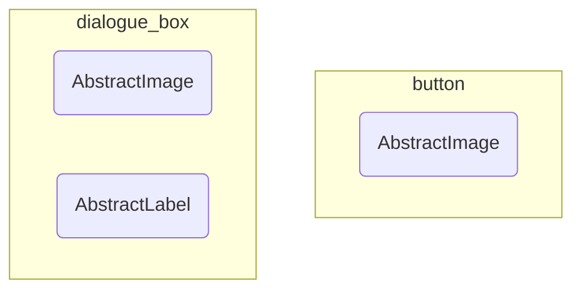
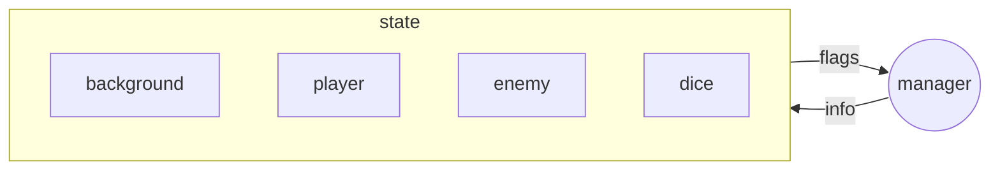
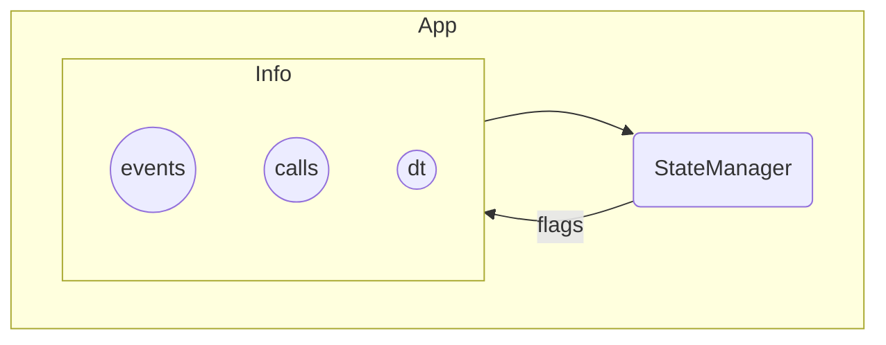

# Core

> [**Go Back**](../../README.md)

<br>

_What will I do with this information? I've written this documentation as a personal note to myself and for_
_my future projects. You can read on if you're a curious on how an engine works in more detail!_

The `core` folder has low-level features that are crucial to running a game. Notable folders include:

- `/control`: Controlling the flow of the entire application.
- `/enums`: Handling user I/O and treating them as events.
- `/components`: Rendering images and text to the screen (with the help of libraries like `pygame`).
- `/path`: Handling pathing and JSON conversions for game data and assets.

The other folders `/pygame_lib` and `/pyglet_lib` are library specific implementations of the core parts.

# `/components`

Components are the building blocks for more complex game objects. Things like buttons, scrolling
backgrounds, and dialogue boxes are made up of many components. 



Components are also primitive utility functions. For components like `AbstractSoundPlayer` and 
`AbstractSpriteSheet`, they aren't used to compose any game object. Instead, they are used to run
other core parts of the game, sound and a quick way to load many images.

In this folder, they act as **interfaces** for primitive game objects. We use libraries such as `pygame` 
or `pyglet` to actually **implement** them.

**The purpose of this indirection is to keep the game engine library-agnostic.**
**Any library can be used as long as it can implement the following components.**

## `AbstractImage`

An image that is displayed on the game screen. 

It is made up of the image (type depends on library), height, and width. Implementation is straight-forward 
as a library only needs to implement the `blit` and `blit_border` drawing methods.

Here's a `pygame` implementation. Notice how `pygame` uses `Surface` to represent images and we use its
corresponding `blit` method to draw it.

```python
import pygame
from .constants import surface
from ..components import AbstractImage

class Image(AbstractImage):
    def __init__(self, image: pygame.Surface):
        super().__init__(image)
        self.width, self.height = self.image.get_width(), self.image.get_height()

    def blit_border(self, pos: tuple[int, int], color: tuple[int, int, int], size: int):
        rect = self.image.get_rect()
        rect.update(pos, (self.width, self.height))
        pygame.draw.rect(surface, color, rect, size)

    def blit(self, pos: tuple[int, int]):
        surface.blit(self.image, pos)
```

## `AbstractLabel`

Text that is displayed on the game screen.

It is made up of the text (a string that will be displayed), font, and color. The library must implement
the `blit` drawing method, which typically involves rendering the text through a font and displaying it.

Here's a `pygame` implementation. Note that `loaded_fonts` is a mapping between `str` to a `pygame` font object.

```python
from .constants import loaded_fonts, surface
from ..components import AbstractLabel

class Label(AbstractLabel):
    def __init__(self, text: str, font: str, color: tuple[int, int, int]):
        assert font in loaded_fonts, f"{font} is not a valid font"
        super().__init__(text, font, color)
        self.rendered_text = loaded_fonts[font].render(text, True, color)
        self.width, self.height = self.rendered_text.get_width(), self.rendered_text.get_height()

    def blit(self, pos: tuple[int, int]):
        surface.blit(self.rendered_text, pos)

# EXAMPLE
label = Label("Hello World", "calibri", [100, 100, 100])
```

## `AbstractSoundPlayer`

A jukebox. It contains a collection of songs that can be played or muted when needed.
Most methods need to be implemented as each library has their own implementation to deal with sounds.

Here's a `pygame` implementation. Notice that we primarily use `pygame.mixer` to implement most of
the functionality.

```python
import pygame
from .constants import loaded_sounds
from ..components import AbstractSoundPlayer


class SoundPlayer(AbstractSoundPlayer):
    def __init__(self):
        super().__init__()
        self.playlist = # example songs

    def reset_player(self):
        pygame.mixer.music.stop()
        pygame.mixer.music.unload()
        pygame.mixer.music.set_volume(0.4)

    def toggle_mute(self):
        self.mute = not self.mute
        if self.mute:
            pygame.mixer.music.pause()
        else:
            pygame.mixer.music.unpause()

    def play_sfx(self, sound: str):
        if not self.mute:
            assert sound in loaded_sounds, f"{sound} is not a valid sound"
            pygame.mixer.Sound(loaded_sounds[sound]).play()

    def change_music(self, sound: str):
        if sound == self.current_song:
            return
        assert sound in loaded_sounds, f"{sound} is not a valid sound"
        self.current_song = sound
        self.reset_player()
        pygame.mixer.music.load(loaded_sounds[sound])
        pygame.mixer.music.play(-1)
        if self.mute:
            pygame.mixer.music.pause()

    def stop_music(self):
        self.current_song = None
        self.reset_player()
```

## `AbstractSpritesheet`

A giant `AbstractImage` that is a grid of smaller `AbstractImages`. Commonly used for
storing animations or related images for an element like a button.

The library must implement the `load_image` method, which loads a specific subimage from a spritesheet.

Here's a `pygame` implementation. Notice the `pygame` specific code in getting a region of the spritesheet
to output.

```python
import pygame
from .image import Image
from ..components import AbstractImage, AbstractSpritesheet

class Spritesheet(AbstractSpritesheet):
    def __init__(self, spritesheet: pygame.Surface, height: int, width: int, rows: int, cols: int):
        super().__init__(spritesheet, height, width, rows, cols)

    def load_image(self, row: int, col: int) -> AbstractImage:
        reference = pygame.Rect(col * self.width, row * self.height, self.width, self.height)
        image = pygame.Surface(reference.size).convert_alpha()
        image.fill((0, 0, 0, 0))
        image.blit(self.spritesheet, (0, 0), reference)
        return Image(image)
```

# `/control`

From a higher level overview, the game is essentially a finite state machine. Each state represents
a "screen" of the game such as a menu screen, saving screen, game over screen, etc. 

In the game DANGERdice, the whole game can be represented as the following state graph.


## `StateManager`

### Background

The `StateManager` is the primary driver behind this finite state machine. 


From this diagram, there are many things to observe about the manager.

- The manager has to keep track of all the states in the FSM.
- The manager can only have one active state at a time.
- The manager has to pass information into that active state.

What type of information does the manager pass into the **active** state?
- `events`: User inputs such as key presses and mouse presses.
- `dt`: Also known as **delta time**. This is passed so the state can execute actions that occur over time 
such as movmenet or timers.
- `draw`: Technically not something that is passed, but is a method the manager calls from the state to 
render graphics.
- Additionally, the manager reads the flags of the states which indicate the manager to transition or quit.

The manager is also responsible for changing the active state when needed. Transitions are a 
two-phase process.

- The manager resets the flag and calls the `cleanup` hook of the active state.
- It changes its active state to the new state and calls the `startup` hook of that new state.

In the end, the `StateManager` runs the whole show. 

### Usage
Using the manager itself is quite easy. There are only two things you need.
- `start`: The name of the starting state. This is the first active state for the manager.
- `states`: A dictionary that maps names to `State` objects. Note that the transitions between states are handled within `State`.

Afterwards, use a `while` loop to repeatedly call `pass_event`, `update`, and `draw` to get the game running.

Example usage of `StateManager`. In this case, the active state is `"start"`. You may wonder where we will get our `Event`s
in order to use `pass_event`. You'll learn more when you read about `App`.

```python
manager = StateManager("start", {"start": Start(), "end": End()})
while True:
    manager.pass_event(None)
    manager.update(0)
    manager.draw()
```

## `State`

### Background

A scene of the game. It's responsible for passing events, updating information, and drawing objects that it
contains. As mentioned before, all of this is orchestrated by the `StateManager`.

If you can think of the `StateManager` as a container for states, think of the `State` as the container for 
game objects.



States contain two hooks: `startup` and `cleanup`.
- `startup` is called before a state actually runs. This is where you can setup objects and load data.
- `cleanup` is called before a state becomes inactive. This is where you can reset attributes and clean up elements.

States are also responsible for managing their transitions via their `to` method. By calling `to(dest)`, the state
will signal to the manager to transition to state `dest`.

### Usage

Since `State` is a base class with abstract `startup`, `cleanup`, `handle_event`, `update`, and `draw` methods,
game states have to inherit from this class and then implement their specific logic.

Example state `Test`. Notice how it will update its own attribute `state_info` on every game update if it is active.
Given enough updates, the state will transition to `Test2`.

```python
class Test(State):
    def __init__(self):
        super().__init__()
        self.state_info = 1

    def startup(self):
        print(self.state_info)

    def cleanup(self):
        self.state_info = 1

    def handle_event(self, event: Event):
        print(event)

    def update(self, dt: float):
        self.state_info += 1
        if self.state_info > 10: self.to("Test2")

    def draw(self):
        # Use a label to display text!
        pass
```

## `Event`

A user input. Consumed by states to trigger some action such as clicking a button or inputting text.
It only supports key presses and basic mouse clicks. Under the hood, it is just a bunch of enums. 
The `/enums` folder contains definitions for event types, key presses, and mouse actions.

# `/lib` Folders

These contain the actual implementations of the components and the driver code that starts the whole application.
When creating the game, you only need to import the `__init__.py` file of `/core`. 

Besides the component implementations, there are a few other noteworthy aspects.

## `App`

A higher-level wrapper over the `StateManager`. This is where you directly use the libraries like `pygame` to handle 
initialization, inputs, and the main game loop. 



`App`s are then ran by driver code contained in `run.py`. These scripts simply initialize the `App`, do some other library 
related setup, and then call the main loop.

A `pygame` implementation of `App`. We see that the app keeps track of a state manager and runs it in `main_loop`. 
In the `event_loop`, we see the translation from `pygame` events to this engine's events.

```python
class App:
    def __init__(self, state_manager: StateManager):
        self.state_manager = state_manager
        self.fps, self.clock = 60, pygame.time.Clock()

    def event_loop(self):
        for event in pygame.event.get():
            if event.type == pygame.QUIT:
                pygame.quit()
                sys.exit()
            elif event.type == pygame.KEYDOWN and event.key in translate_keys:
                self.state_manager.pass_event(Event(EventType.KEY_DOWN, key=translate_keys[event.key]))

    def main_loop(self):
        """Where the game takes place."""
        while not self.state_manager.is_done():
            dt = self.clock.tick(self.fps) / 1000
            if dt >= 0.05:
                continue
            self.event_loop()
            self.state_manager.update(dt)
            self.state_manager.draw()
            pygame.display.update()

# EXAMPLE
manager = StateManager("start", {"start": Start(), "end": End()})
app = App(manager)
app.main_loop()
```

## `Constants`

Contains library-specific constants.

- Assets which are loaded using the library. Paths to the assets are found in `/path`.
- Translations from the library's events to the game engine's `Event`.
- Additional setup that couldn't be done in `run.py`.
