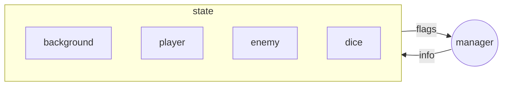
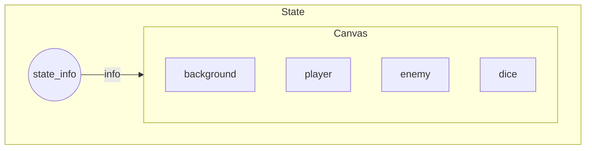
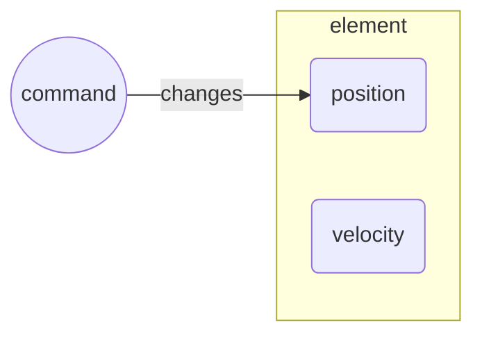
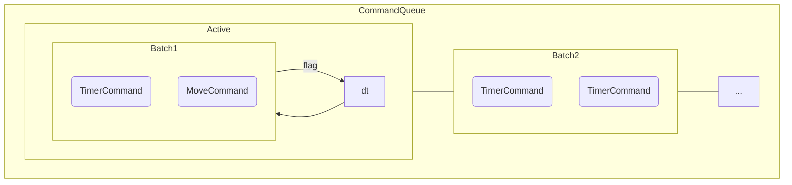
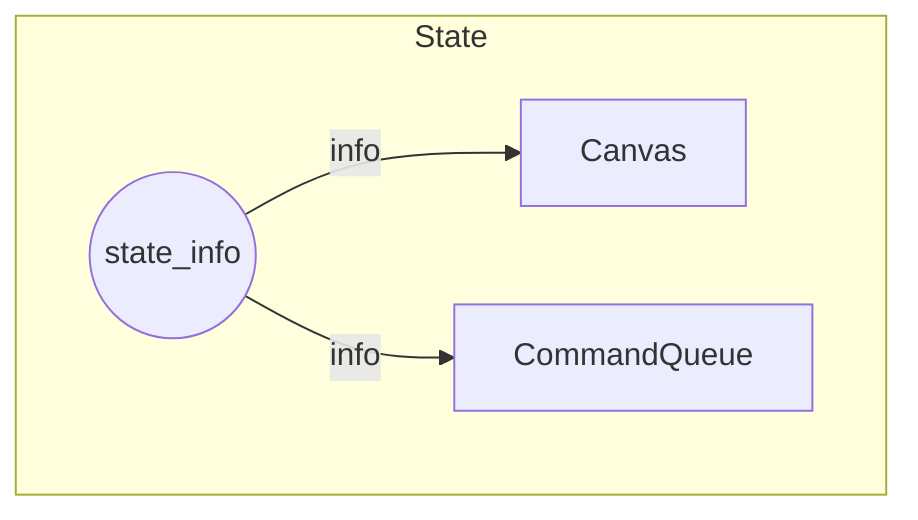

# GUI

> [**Go Back**](../../README.md)

<br>

_What will I do with this information? I've written this documentation as a personal note to myself and for_
_my future projects. You can read on if you're a curious on how an engine works in more detail!_

The `gui` folder implements all the UI and displayable elements that are seen in the game. These elements are 
made up of components implemented in `/core`. Notable folders include:

- `/commands`: Manipulating elements over time.
- `/elements`: The actual UI elements such as buttons, text inputs, etc.
- `/utils`: Utility classes to help implement elements.

There is also the `Canvas` which is a container for elements.

# Canvas

## Background

Before we talk about elements, we need to talk about how elements fit into the bigger picture. From `/core`, we
became familiarized with the concepts of states; states were containers for elements.

This is a diagram you were introduced with. The `StateManager` passes info to the `State` and the `State` uses
that info to manage its inner elements.



If we zoom into the `State` and ignore the manager, this is the structure you see.



You'll notice that within a state is a `Canvas`. This is the actual object that manages all the elements.

---

The `Canvas` is a list of GUI elements. It display elements in a FIFO order, meaning the elements that are first 
will be displayed in the bottom layer.

The list itself consists of tuples of `(Displayable, str)` where `Displayable` is the element itself and `str` 
is the group the element is a part of. This provides ease in deleting lots of elements at once (such as clearing a screen).

Every game loop, the canvas has to pass inputs, update state, and draw each element.

## Usage

Using the `Canvas` is simple as it's adding and removing elements like you would a list.

```python
# Create the Canvas
canvas = Canvas()

# Add elements to the canvas. It is in the group "entities"
canvas.add_element(player_display, "entities")
canvas.add_element(enemy_display, "entities")

# Add some more elements. It is in the group "background"
canvas.add_element(hills, "background")

# Remove the "entities" group
canvas.delete_group("entities")

# The main loop; note that the state should handle this
while True:
    canvas.handle_event(None)
    canvas.update(0)
    canvas.draw()
```

# `/elements`

## `Displayable`

The base class for any displayable element. It is made up of a list of `AbstractImage`s that represent the 
element visually, a position, and `theme` which is used to customize the attributes of a particular element like color.

It contains abstract methods for handling input, updating its internal state, and drawing itself. All elements 
inherit from this class.

Here's an example of a background element.

```python
class StaticBG(Displayable):
    def __init__(self, images: list[AbstractImage], pos: tuple[int, int]):
        super().__init__(images, pos, {})

    def draw(self):
        self.images[0].blit(self.get_position())
```

## `Interactive`

The base class for any element you can interact with. It is a child class of `Displayable`. The only additional 
parameter it needs is `on_event`, a callback function that is triggered by user input.

Here's an example of a button element.

```python
class Button(Interactive):
    def __init__(self, images: list[AbstractImage], pos: tuple[int, int], 
                       theme: dict, on_event):
        super().__init__(images, pos, theme, on_event)
        self.clicked, self.hovered = False, False

    def current_picture_index(self) -> int:
        if self.clicked: return 2
        elif self.hovered: return 1
        else: return 0

    def handle_event(self, event: Event):
        if not event.is_mouse_event(): return
        if self.is_mouse_over_element(event):
            self.hovered = True
            if event.get_type() == EventType.MOUSE_DOWN and self.on_event:
                SOUND_PLAYER.play_sfx(self.theme["sfx"])
                self.clicked = True
                self.on_event()
            else: self.clicked = False
        else: self.hovered = False

    def draw(self):
        self.images[self.current_picture_index()].blit(self.get_position())
        self.draw_border()
```

# `/commands`

Commands are actions that execute over a period of time via updates. These actions typically involve modifying 
GUI components, but can also be used to call other types of functions after a certain period of time.

## `Command`
Actions that execute over a period of time. They have a callback function (called when the command is done) and 
a flag called `done`.

There are two primary types of commands.

- `MoveCommand`: A command that controls an `Idle` element, moving it at a certain speed from `start` to `dest`. 
Primarily used for setting up animations and cutscenes. This is done through modifying the element's position over time.



- `TimerCommand`: A command that runs `func` after a certain number of `frames` has passed. 
Typically used for setting up delays or timing for animations.

## `CommandQueue`

### Background

Processes batches of queued up commands in FIFO fashion.

Typically, a queue looks like this. You'll notice that this has a similar structure to the `StateManager` or
`Canvas`.



And what runs the `CommandQueue` itself? The `State`.



Here's some info about the queue.
- When adding to the queue, you add batches of commands to run at the same time rather than one command at a time.
- The queue will process a batch of commands until all commands in that batch indicate their `done` flag is `True`. At 
this point it will run the next batch of commands.

In addition, the `AnimationHandler` can be seen as presets for batches of commands to feed into the queue. This is used 
to store frequently seen animations.

### Usage

Similar to `Canvas`, using the `CommandQueue` is simple as it's adding and removing elements like you would a list.

```python
# Create the CommandQueue
command_queue = CommandQueue()

# First batch: a single TimerCommand that will call print
command_queue.add([TimerCommand(1.2, lambda: print("Hello, World"))])

# Second batch: moving an element and another TimerCommand
command.queue.add([
    TimerCommand(1.1, lambda: print("I am another command!")),
    MoveCommand(player_display, (5, 0), (0, 0), (1000, 0), lambda: print("I am done moving!"))
])

# The main loop; note that the state should handle this
# Commands will be processed given enough iterations
while True:
    command_queue.update(0.1)
```

# `/utils`

A collection of objects used in constructing elements.

- `DeltaTimerRunner`: Runs functions periodically after enough time has passed on every update.
- `DialogueData`: Keeps track of a sequence of texts and images. Displays text one character at time per update to simulate a 
typing effect. Used to implement the `DialogueBox` which is just a graphical representation.
- `IndexCycler`: Essentially a 2D list of numbers. Loops through a particular row of numbers when enough time has passed. If 
it reaches the end of a row, it loops through another row chosen randomly. Used to implement idle animations, as each row represents 
a particular animation to play.
