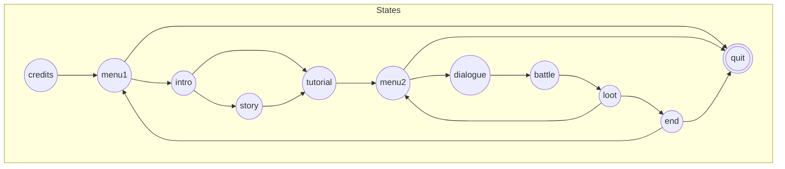
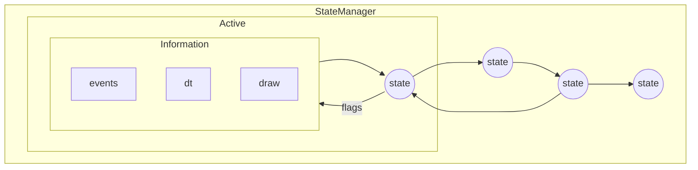
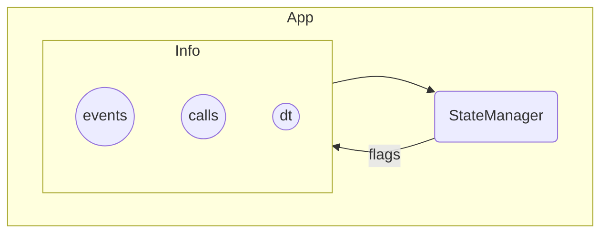
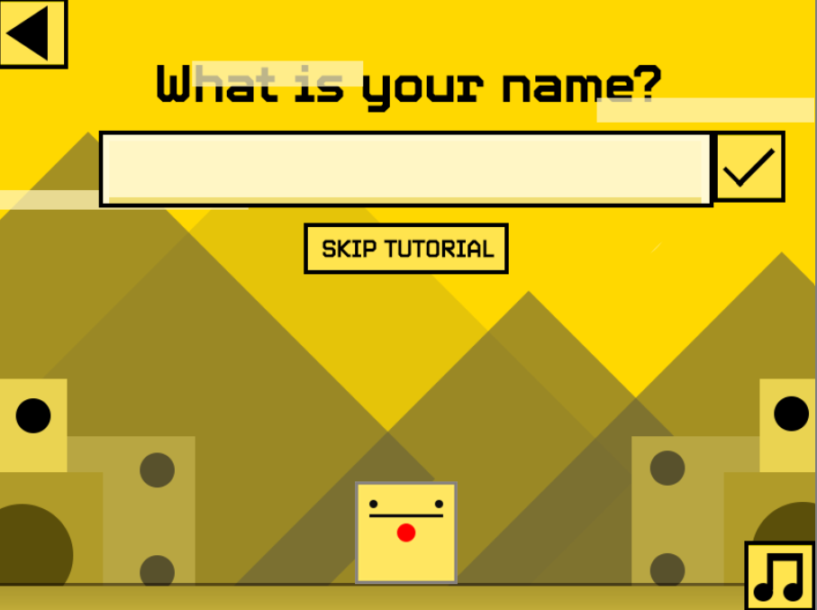

# Creating Game States

> [**Go Back**](../README.md)

<br>

_What will I do with this information? I've written this documentation as a personal note to myself and for_
_my future projects. You can read on if you're curious on how an engine works in more detail!_

For people that are here to enjoy a questionably-built game, you don't need to read this! Just play the game
demo on the web or download the game itself for a better experience!

The objective of this guide is to give an **overall view** on how to use the engine. The other docs `core.md`
and `gui.md` give you a breakdown of each of the parts of the engine, but this guide serves to tie 
everything together by walking you through **the creation of a game state**.

# Some Background

From a higher level overview, the game is essentially a finite state machine. Each state represents
a "screen" of the game such as a menu screen, saving screen, game over screen, etc. 

The whole game can be represented as the following state graph.



The `StateManager` is the primary driver behind this finite state machine. 



Then the `App` is the primary driver behind the `StateManager`.



For our purposes, you don't really need to know about how these things work exactly. It's just good to
know the overall architecture of the whole game, and will help us better understand the functions
we need to implement for our game state.

# The Base State

Let's take a look at the base state we will be implementing.

```python
class GameState(State):
    """A game state."""

    def __init__(self):
        super().__init__()
        self.canvas, self.command_queue = Canvas(), CommandQueue()
        self.persistent_data = PERSISTENT_DATA

    def reset_state(self):
        """Resets attributes for a state when leaving."""
        pass

    def setup_state(self):
        """Sets attributes for a state when entering."""
        pass

    def setup_canvas(self):
        """Sets up the canvas for the state."""
        pass

    def setup_commands(self):
        """Sets up initial commands to run if needed."""
        pass

    def setup_music(self):
        """Sets up the music."""
        pass

    def update_components(self):
        """Update dynamic components based on external information.."""
        pass

    def startup(self):
        self.setup_state()
        self.setup_canvas()
        self.setup_commands()
        self.setup_music()

    def cleanup(self):
        self.canvas.delete_all()
        self.command_queue.clear()
        self.reset_state()

    def handle_event(self, event: Event):
        self.canvas.handle_event(event)

    def update(self, dt: float):
        self.command_queue.update(dt)
        self.update_components()
        self.canvas.update(dt)

    def draw(self):
        self.canvas.draw()
```

That's quite a lot of code! But here's a run down of the most important parts.

- A bunch of helper functions that separate different tasks. These are optionally implemented.
- `startup` is a hook called when the state is being entered. This is where you set up all your
components like spawning enemies, setting up UI, etc.
- `cleanup` is a hook called when the state is being exited. This is where you "clean up" like
maybe despawning enemies, clearing out UI or other temporary data, etc.
- `draw`, `update`, and `handle_event` will be called on every game frame. As their name suggests,
the functions handle drawing, updating state information, and handling input respectively.

In addition, you'll notice that each state has access to a `Canvas`, `CommandQueue`, and `PERSISTENT_DATA`.

- `Canvas` contains ALL of the game objects a state has. Its methods are called in `draw`, `update`, and 
`handle_event`.
- `CommandQueue` is used to run actions over time that either change the state or modify the game objects 
within `Canvas`. Its methods are called in `update`.
- `PERSISTENT_DATA` is where we access data that persists **between states**. For our game, this includes 
our player stats.

# Implementing the Intro

With this background info, let's implement a name screen similar to the one seen in DANGERDice. 
We will be using the `intro.py` state as reference.

<p align="center"></p>

Let's identify the parts we need to have for this state!

- There are going to be three buttons of concern: the back button, the confirm button, and the
mute button. We will skip the "SKIP TUTORIAL" button for this case.
- There's a text input right below "What is your name?".
- There's a background behind everything.
- There's our player character at the bottom of the screen.

Now that we have the parts we need, let's start implementing!

---

This is the code we have at the beginning. We are inheriting from `GameState` and we currently have 
an empty class.

```python
class Intro(GameState):
    pass
```

Let's first create the elements we need. We can do this in `setup_canvas` which is already called in
`startup`. This means that the elements are created whenever we enter this state.

Notice that when we are creating our buttons and input, they have a callback function as their last
argument.

- `self.enter_name` will be implemented later. This is where we do something after we submit a name.
- `SOUND_PLAYER.toggle_mute` toggles sound muting from an imported `SOUND_PLAYER`.
- `text_input.submit_text` calls `text_input`'s callback directly. This links the button to the text
input.

```python
class Intro(GameState):
    def setup_canvas(self):
        # Decorative Elements
        background = StaticBG([get_image("bg")], (0, 0))
        player = Idle(get_all_sprites("player"), (350, 472), None, load_idle_animation("player"))

        # Text Input
        text_input = InputText(get_all_sprites("input"), (100, 130), INPUT_DEFAULT, self.enter_name)

        # Buttons
        mute_button = Button(get_sprites("music"), (730, 530), BUTTON_DEFAULT, SOUND_PLAYER.toggle_mute)
        back_button = Button(get_sprites("back"), (0, 0), BUTTON_DEFAULT, lambda: print("back"))
        confirm_button = Button(get_sprites("confirm"), (700, 130), BUTTON_DEFAULT, text_input.submit_text)
```

Then we can add all of these to the state's canvas so that they can be rendered and accept inputs.
Since we won't be doing any dynamic element adding/removal, all elements will be under the same group.

Take note that order matters. We place background as the first element since we want it drawn the
furthest back. Otherwise it would cover our other elements.

```python
class Intro(GameState):
    def setup_canvas(self):
        # Decorative Elements
        background = StaticBG([get_image("bg")], (0, 0))
        player = Idle(get_all_sprites("player"), (350, 472), None, load_idle_animation("player"))

        # Text Input
        text_input = InputText(get_all_sprites("input"), (100, 130), INPUT_DEFAULT, self.enter_name)

        # Buttons
        mute_button = Button(get_sprites("music"), (730, 530), BUTTON_DEFAULT, SOUND_PLAYER.toggle_mute)
        back_button = Button(get_sprites("back"), (0, 0), BUTTON_DEFAULT, lambda: print("back"))
        confirm_button = Button(get_sprites("confirm"), (700, 130), BUTTON_DEFAULT, text_input.submit_text)

        # Adding to Canvas
        elements = [background, player, text_input, mute_button, back_button, confirm_button]
        for element in elements: self.canvas_add_element(element, "group")
```

Now when we run the state, these elements should be displayed and you can interact with the inputs.
Let's have the state do something when we input the name. 

Implement `enter_name`. For our implementation, we will have the state transition to the state `story`
after enough time has passed. We do this by creating a `TimerCommand` and adding it to the `command_queue`.

The `command_queue` will process this command every frame. Luckily, you don't have to worry about these
details when implementing!

```python
class Intro(GameState):
    def setup_canvas(self):
        # Decorative Elements
        background = StaticBG([get_image("bg")], (0, 0))
        player = Idle(get_all_sprites("player"), (350, 472), None, load_idle_animation("player"))

        # Text Input
        text_input = InputText(get_all_sprites("input"), (100, 130), INPUT_DEFAULT, self.enter_name)

        # Buttons
        mute_button = Button(get_sprites("music"), (730, 530), BUTTON_DEFAULT, SOUND_PLAYER.toggle_mute)
        back_button = Button(get_sprites("back"), (0, 0), BUTTON_DEFAULT, lambda: print("back"))
        confirm_button = Button(get_sprites("confirm"), (700, 130), BUTTON_DEFAULT, text_input.submit_text)

        # Adding to Canvas
        elements = [background, player, text_input, mute_button, back_button, confirm_button]
        for element in elements: self.canvas_add_element(element, "group")
    
    def enter_name(self, text: str):
        timer = TimerCommand(10, lambda: self.to("story"))
        self.command_queue.add([timer])
```

Last but not least, we should add some cleanup when we leave our state. Let's implement `cleanup`.

```python
class Intro(GameState):
    def setup_canvas(self):
        # Decorative Elements
        background = StaticBG([get_image("bg")], (0, 0))
        player = Idle(get_all_sprites("player"), (350, 472), None, load_idle_animation("player"))

        # Text Input
        text_input = InputText(get_all_sprites("input"), (100, 130), INPUT_DEFAULT, self.enter_name)

        # Buttons
        mute_button = Button(get_sprites("music"), (730, 530), BUTTON_DEFAULT, SOUND_PLAYER.toggle_mute)
        back_button = Button(get_sprites("back"), (0, 0), BUTTON_DEFAULT, lambda: print("back"))
        confirm_button = Button(get_sprites("confirm"), (700, 130), BUTTON_DEFAULT, text_input.submit_text)

        # Adding to Canvas
        elements = [background, player, text_input, mute_button, back_button, confirm_button]
        for element in elements: self.canvas_add_element(element, "group")

    def cleanup(self):
        self.canvas.delete_all()
    
    def enter_name(self, text: str):
        timer = TimerCommand(10, lambda: self.to("story"))
        self.command_queue.add([timer])
```

There you go, we have created a working game state! Although the engine is extensive, the actual usage
is not too complex. Just add elements and some logic and you're all set!

# Conclusion

Hope you enjoyed following that example implementation! Most states in DANGERDice follow a very similar
format. Although this system is a bit clunky and outdated, it still was a great experience creating
a framework that makes this all possible!
